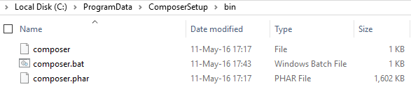

# Database Migration Menggunakan Phinx
Migrasi database lebih mudah dengan menggunakan [Phinx](https://phinx.org/)

# Instalasi Phinx
- Pastikan sudah instal [Composer](https://getcomposer.org/)
- `Composer` sudah dipath ke environment, kalo gw folder ini yang dipath

    

- Command dijalankan di root folder proyek, misal `C:\xampp\htdocs\phinx-example>`
- Tulis ini untuk instal phinx : `composer require robmorgan/phinx`
- Lanjut tulis ini untuk keperluan seeding : `composer require fzaninotto/faker`

# List Command Phinx
Berikut ini beberapa command/perintah yang digunakan untuk berkegiatan menggunakan **Phix** 

## UNIX User
Bisa menggunakan command pada tutorial langsung

## Windows user
- Inisialisasi phinx : `vendor\\bin\\phinx.bat init`
- Membuat kelas migrasi : `vendor\\bin\\phinx.bat create CreateUserTable` 
- Menjalankan semua migrasi : `vendor\\bin\\phinx.bat migrate`
- Menjalan migrasi kelas tertentu (sesuai waktu) : `vendor\\bin\\phinx.bat create CreateUserTable -t 20160702095511`
- Membatalkan perintah migrasi terakhir : `vendor\\bin\\phinx.bat rollback`
- Membuat kelas seed untuk mengisi data : `vendor\\bin\\phinx.bat seed:create UserSeeder`
- Menjalankan semua kelas seed : `vendor\\bin\\phinx.bat seed:run`
- Menjalankan kelas seed tertentu : `vendor\\bin\\phinx.bat seed:run -s UserSeeder`

# Pengaturan Database
Koneksi database dapat diatur pada file `phinx.yml`